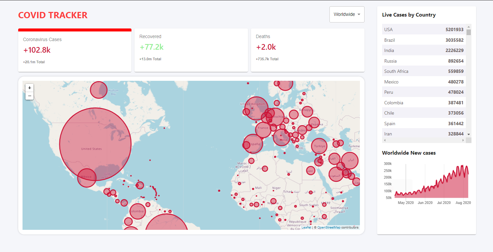

### Link to the project

        https://covid-19-tracker-d007c.web.app/

## Clone the project

        `git clone https://github.com/itsjustmithun/Covid-tracker-React.git`

### Run the code

        `npm start`

Runs the app in the development mode. 
Open [http://localhost:3000](http://localhost:3000) to view it in the browser.

The page will reload if you make edits. 
You will also see any lint errors in the console.

### To Build the project

        `npm run build`
    
Builds the app for production to the build folder.
It correctly bundles React in production mode and optimizes the build for the best performance.

